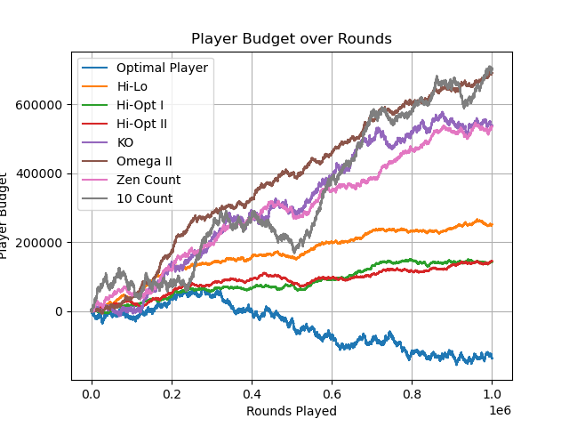
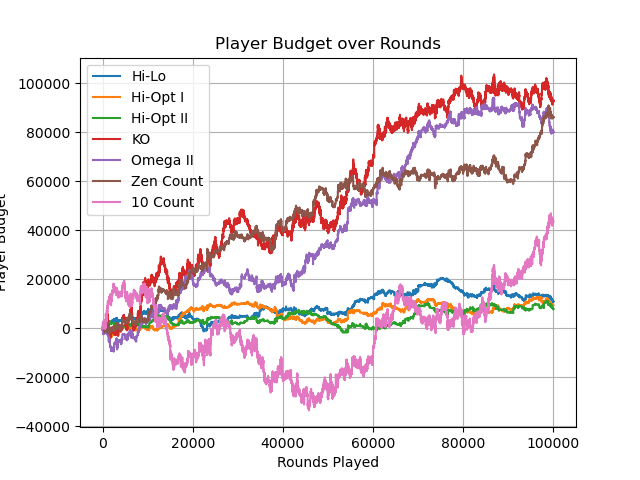
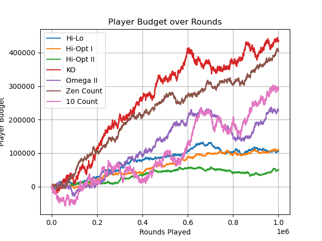

# Blackjack Simulator

This project aims to simulate multiple strategies of playing Blackjack.

We hope to distinguish the differences in making money between different strategies,
especially different card counting approaches.

## How to run

```
$ git clone <link>

Either
$ conda install --file requirements.txt
or
$ pip -r requirements.txt


$ python blackjack.py
```

## Strategies

* Basic Strategy
* Random player
* Gamblers fallacy player
* Hi-Lo card counter
* Hi-Opt I card counter
* Hi-Opt II card counter
* KO card counter
* Omega II card counter
* Zen count card counter
* 10 count card counter

More detail about the different card counter strategies can be found [here](https://en.wikipedia.org/wiki/Card_counting)


## Playing by yourself

We have also implemented a way you can play via the terminal.

You can choose 'play by yourself' when starting the application.


## Results

Here are a few pre-computed plots for various strategies and number of rounds played:

### All Players

As you can see in both charts above the *Average Player* is quite eratic while the *Random Player* is just loosing money continuously.


### Only Basic Strategy and Card Counters

In both of these charts you can see that the Basic strategy (*Optimal Player*) looses over time while the card counters tend to win.




### Only Card Counters

These charts give a more detailed overview of the different card counting strategies.






